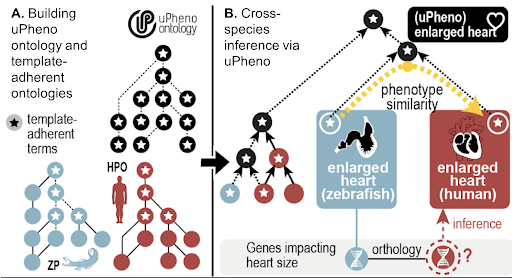
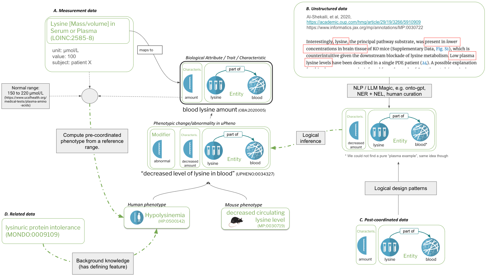
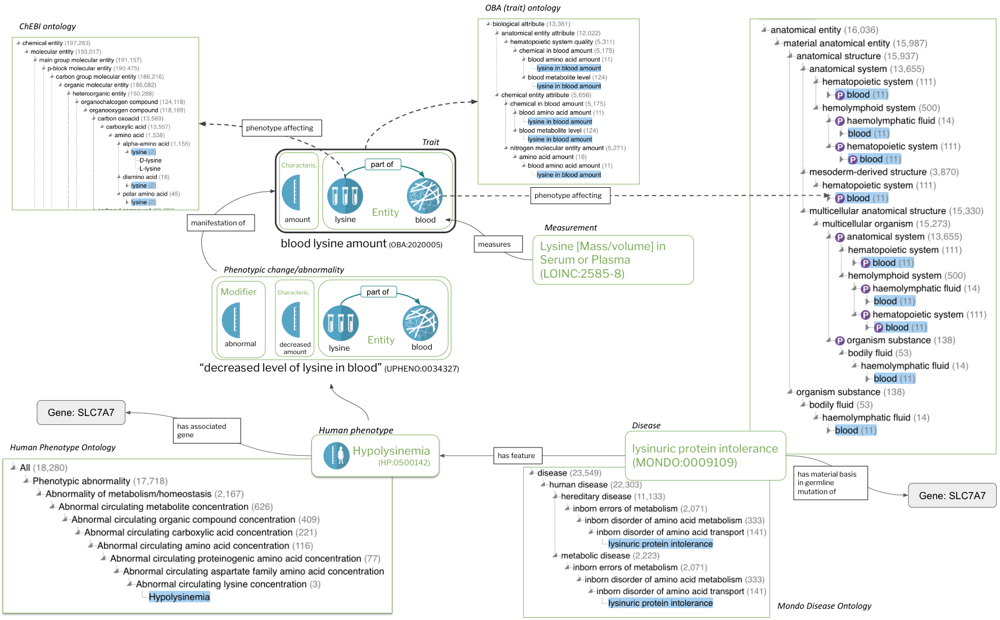

## Integrating phenotype data using the uPheno framework

### Prerequisites

- [Familiarise yourself with the core concepts](../reference/core-concepts.md)
- [Familiarise the basics of phenotype data](../reference/phenotype-data.md)

### Level 1 integration: Data

Before we get started, let's remind ourselves of the basic structure of phenotype data.


!!! note "Figure 1: Core concepts"

    _Characteristics_ (A) and _bearers_ of characteristics (B) are the core constituents of traits/biological attributes (C). _Phenotypes_ are comprised of trait terms (C) combined with a modifier (D). Species-specific phenotypes (F), including _phenotypic abnormalities_ defined in the Human Phenotype Ontology (HPO) are feature of diseases (G). Measurements (H), such as assays, quantify or qualify (measure) traits (C).

Phenotype data can be integrated to various degrees into the uPheno framework. Please note:

!!! note "The goal of phenotype data integration"

    The goal of phenotype data integration in the sense of this document is to associate phenotype data records with pre-coordinated trait and/or phenotype terms from a phenotype ontology.

The [promise of phenotype data integrated this way](../reference/use-cases.md) ranges from simple data aggregation (give me all data pertaining to changed levels of amino acids)
to complex semantic comparisons of phenotypic profiles for matching patients to diseases.

!!! warning

    The question of how to turn phenotype data records into [associations](https://biolink.github.io/biolink-model/association-examples-with-qualifiers/),
    for example for use in a knowledge graph, is out of scope for this document. We are only concerned with how the phenotype described by the data record
    can be integrated.

The "uPheno framework" is a loose term that describes a family of techniques and ontologies. In terms of ontologies, it includes (among others):

- The Phenotype And Trait Ontology (PATO) for the representation of general characteristics (the fact that its called "Phenotype and Trait" is a bit misleading, as it contains a lot of characteristics that are widely used also for environmental data, like `weight` and `amount`)
- The Ontology of Biological Attributes (OBA) for the representation of biological traits
- The Unified Phenotype Ontology (uPheno) for the representation of phenotypic change

As can be seen in Figure 1 at the top of this document, all of these are interconnected:

1. Biological traits (e.g. "lysine level in the blood") in OBA are a direct extension of the "general" characteristics described in PATO (e.g. "level", or "amount").
1. Terms describing phenotypic change (such as "decreased levels of lysine in the blood") are automatically liked to their corresponding traits (at the time of this writing using "has part", for reasons too complicated to explain here)

<!--TODO: We should probably add an FAQ about the "has-part" modelling choice. -->

Integrating all kinds of phenotype data into the "uPheno framework" is a complex process which we will break down in the following.
We will look at a [range of different kinds of phenotype data](../reference/phenotype-data.md) to illustrate the system (not exhaustive!):

- [Integrating cross-species pre-coordinated phenotype data](#cross-species)
- [Integrating post-coordinated phenotype data](#postcoordinated)
- [Integrating quantitative phenotype data](#quantitative)
- [Integrating unstructured phenotype data](#unstructured)

<a id="cross-species"></a>

#### Integrating cross-species pre-coordinated phenotype data



!!! note "Figure 2: uPheno cross-species integration"

    uPheno integrates species-specific pre-coordinated phenotype ontologies such as HPO and ZP.
    Species specific phenotype terms like "enlarged heart (ZP)" or "Enlarged heart (HPO)" are
    integrated under a common uPheno class which is species-independent.

The simplest form of phenotype integration is grouping cross-species, pre-coordinated
phenotype terms under species independent parents. There are two basic techniques to consider here:

1. [Design pattern-driven integration](#designpattern).
2. [Mapping-based integration](#mapping)

<a id="designpattern"></a>

Integration using _design patterns_ is a very laborious process and works as follows:

1. A _common design pattern_ is defined for a group of phenotypes.
For example, the phenotypic abnormality "decreased lysine level in the blood" follows the pattern [abnormal amount of chemical entity in location](http://purl.obolibrary.org/obo/upheno/patterns/abnormalLevelOfChemicalEntityInLocation.yaml).
A large number of such design patterns have been defined in the [Dead Simple Ontology Design Patterns (DOSDP) format](https://github.com/INCATools/dead_simple_owl_design_patterns) by the [Phenotype Ontology Reconciliation Effort](../reference/reconciliation-effort.md) and can be [browsed here](https://github.com/obophenotype/upheno/tree/master/src/patterns/dosdp-patterns).
- Species-specific phenotype ontologies implement those patterns to define phenotype terms in their ontology logically.
- uPheno terms are automatically generated for all existing phenotype terms defined this way by simply generating a new, species-indepedent terms that disregards the taxon-constraints imposed by species-specific ontologies. For example, if the Zebrafish Phenotype Ontology (ZP) uses Zebrafish Anatomy Ontology (ZFA) terms, they are generalised to Uberon terms, which are species independent anatomy terms.
- Now we can simply stick the generated uPheno classes and the species-specific phenotype ontology terms together, run an OWL reasoner such as Elk and get the groupings we want.

!!! warning

    The process of defining pre-coordinated ontology terms using logical definitions is
    extremely labourious.
    The situation is aggrevated by the fact that selecting the right pattern for a given
    phenotype is error prone, so that two communities could end up defining "analogous phenotypes" using different patterns, which results in them not being integrated well or at all.
    The [Phenotype Ontology Reconciliation Effort](../reference/reconciliation-effort.md) is a
    big effort to try and mitigate this through community coordination ([reconciliation meetings](../organization/meetings.md)).
    In 2024, we are slowly beginning to experiment with scaling this bottleneck by emplying
    Large Language Models to help curating such definitions automatically, with tools like
    [ontogpt](https://github.com/monarch-initiative/ontogpt).

_Mapping-based integration_ is less powerful, but more scalable that pattern driven solutions and essential to describe phenotypes that cannot be described using EQ definitions.
It works as follows:

1. Matching tools are employed to generate mapping candidates across species-specific phenotype ontologies.
1. Curators review mapping candidates and store them in a common format (for example, MGI is curating a set of [MP-HP mappings](https://github.com/mapping-commons/mh_mapping_initiative/blob/master/mappings/mp_hp_mgi_all.sssom.tsv), Monarch Initiative is publishing logical and lexical cross-species mappings in their [Mapping Commons](https://github.com/monarch-initiative/monarch-mapping-commons), etc).
1. During the automated construction of uPheno, mapped classes are grouped under a common uPheno parent, even if a logical pattern cannot be precisely determined.

!!! warning

    As of April 2024, the process of grouping mapped phenotypes under a common uPheno concept is under still development and has not yet been included in the main uPheno framework.

<a id="postcoordinated"></a>

#### Integrating post-coordinated phenotype data

!!! note

    Before reading this section make sure you understand what [post-coordinated phenotype data is](../reference/phenotype-data.md).

Lets remind ourselves of an example of post-coordinated phenotype data from ZFIN:

| Fish ID | Affected Structure or Process 1 subterm ID | Affected Structure or Process 1 subterm Name | Post-composed Relationship ID | Post-composed Relationship Name | Affected Structure or Process 1 superterm ID | Affected Structure or Process 1 superterm Name | Phenotype Keyword ID | Phenotype Keyword Name | Phenotype Tag | Affected Structure or Process 2 subterm ID | Affected Structure or Process 2 subterm name | Post-composed Relationship (rel) ID | Post-composed Relationship (rel) Name | Affected Structure or Process 2 superterm ID | Affected Structure or Process 2 superterm name | Publication ID |
|-----------------------|--------------------------------------------|----------------------------------------------|-------------------------------|---------------------------------|----------------------------------------------|--------------------------------------------------|----------------------|-------------------------------------|---------------|--------------------------------------------|----------------------------------------------|-------------------------------------|---------------------------------------|----------------------------------------------|--------------------------------------------------|-------------------|
| ZDB-FISH-210421-9 | ZFA:0009290 | glutamatergic neuron | BFO:0000050 | part_of | ZFA:0000008 | brain | PATO:0040043 | increased proportionality to | abnormal | ZFA:0009276 | GABAergic neuron | BFO:0000050 | part_of | ZFA:0000008 | brain | ZDB-PUB-191011-2 |

The entities comprising the phentype are:

- ZFA:0009290 (glutamatergic neuron): The primary entity whose characteristic is being observed
- BFO:0000050 (part of): a relation used to connect the primary entity to the structure it is part of
- ZFA:0000008 (brain): the location of the primary entity being observed
- PATO:0040043 (increased proportionality to): the modified characteristic being observed
- abnormal: the change modifier (note: not an ontology term)
- ZFA:0009276 (GABAergic neuron): the secondary entity being observed in relation to which the characteristic is measured
- ZFA:0000008 (brain): the location of the secondary entity

1. We can down define a pattern for capturing this phenotype (in this case, an [as-of-yet non-standard pattern](https://github.com/obophenotype/zebrafish-phenotype-ontology/blob/master/src/patterns/dosdp-patterns/abnormalQualityPartOfThingTowardsPartOfThing.yaml)) that is compatible with the Entity-Quality model employed by the uPheno framework.
1. Next, we map the constituents of the phenotype (or rather, the columns in the ZFIN data table) to slots in the design pattern.
1. Now, we can simply generate the complete class, including labels and logical definitions and proceed with [pre-coordinated integration](#designpattern) as described above.

!!! example "Example: brain increased proportionality to glutamatergic neuron GABAergic neuron brain, abnormal"

    The interested reader may look at an integrated version of that huge post-coordinated expression [here (brain increased proportionality to glutamatergic neuron GABAergic neuron brain, abnormal - ZP:0141834)](https://www.ebi.ac.uk/ols4/ontologies/zp/classes/http%253A%252F%252Fpurl.obolibrary.org%252Fobo%252FZP_0141834).

!!! info "Should we pre-coordinate _all_ post-coordinate phenotype data?"

    The [Zebrafish Phenotype Ontology (ZP)](https://www.ebi.ac.uk/ols4/ontologies/zp) and the
    [Xenopus Phenotype Ontology (XPO)](https://www.ebi.ac.uk/ols4/ontologies/xpo) are two examples of efforts where pre-coordinated phenotype ontologies where constructed completely from design patterns. However, it is not always necessary to formally publish pre-coordinated ontologies for all available phenotype data.
    The [Monarch Initiative](https://monarchinitiative.org/) for example chooses to directly generate _species-independent_ grouping classes for some of the post-coordinated phenotype data ingests they support for inclusion in their knowledge graphs, such as some FlyBase datasets and SGD phenotype data.
    In other scenarios, _not even that may be necessary_. A semantic data scientist may simply choose to generate _temporary_ classes from post-coordinated phenotype data, run their analysis and discard them afterwards.

<a id="quantitative"></a>

#### Integrating quantitative phenotype data

The integration of quantified phenotype data into the uPheno project is still in the early stages.
Driven by Robinson et al. from the [Monarch Initiative](https://monarchinitiative.org/), and possible other research groups, the idea is to formally curate reference ranges for all quantified biological traits and then use
that information to automatically generate corresponding pre-coordinated phenotype terms.

For example, lets assume we have a reference range for tail length that says "25-30 cm". Now, we can translate a quantified phenotype data point like "tail length of 35 cm" automatically
to a pre-coordinated phenotype term such as "abnormally increased tail length".
We can do that by simply combining the trait term "tail length" with the "abnormal" modifier, which immediately establishes a link to the corresponding term from a pre-coordinated ontology such as HPO or MP.

<a id="unstructured"></a>

#### Integrating unstructured phenotype data

!!! note

    Before reading this section make sure you understand what [unstructured phenotype data is](../reference/phenotype-data.md).

Integrating unstructured data is, essentially, a combination of "entity recognition", the task of recognising that a sequence of words in a text correspond to a distinct [phenotype concept](../reference/core-concepts.md) with "entity grounding" (or linking), the task of assigning an ontology term the recognised entity.
Successfully integrating data this way is one of the the holy grails for phenomics, as much of the available phenotype data is still buried in unstructured text like clinical notes and scientific publications, and a problem that is by far from solved.

Here are some of the most promises paths to integrating such data:

1. Basic NLP techniques. For a lot of _quasi-structured_ data, where reasonably standardised terminology is used in a reasonably structured environment such as a database,
basic NLP techniques such as string-normalisation, string matching and fuzzy lexical matching  actually works quite well.
The advantage of such techniques is that they are not only deterministic (e.g. always resulting in the same result), they are also very transparent, which means they can be easily reviewed and accepted by a human curator.
2. Advanced methods based on Large Language Models. Tools like [ontogpt](https://github.com/monarch-initiative/ontogpt) are good choices to try and extract structured information from
unstructured sources where basic NLP techniques fail to yield any useful results.
Note though that such methods lack the transparency of basic methods, which means they impose a higher burden on human reviewers in scenarios where accuracy is essential.

!!! tip

    For people working on named entity recognition there is a bit of a point to be made to try and extract not only the complete phenotype expression, but actually map the individual components, like characteristics and chemicals. If you do that, you can directly construct a pre-coordinated phenotype class compatible with the uPheno framework, even if no such class currently exists. Even if it does, it would easily be recognisable as an "inferred equivalent class".

#### Summary



!!! note "Figure 3: data integration with uPheno"

    Figure 3 shows 4 different kinds of integration:

    - A: Measurement data. A measurement in conjunction with a normal range and a mapping to a trait term is transformed to a Phenotypic abnormality term in HPO.
    - B: Unstructured data. Free text, for example in a paper, is translated into pre-coordinated uPheno expressions
    - C: Post-coordinated data. Mapped into uPheno expressions using design patterns.
    - D: Related data. Mapped to phenotype terms using specific associations.

### Level 2 integration: Knowledge

The real magic with respect to computational phenotype data comes through the integration of knowledge.

!!! info

    Knowledge is an elusive term, but here we mean simply: [qualified associations](https://biolink.github.io/biolink-model/association-examples-with-qualifiers/) to other entities, such as gene-to-phenotype associations.

In the following we discuss a few of the most common forms of knowledge.

1. [Core ontological relationships such as "is-a" or "part-of"](#ontological)
1. [Core phenotype relationships such as "characteristic-of" and "has-modifier"](#phenorel)
1. [Knowledge graph associations](#associations)

<a id="ontological"></a>

_Core ontological relationships_ such as "is-a" or "part-of" are the most boring of all kinds of knowledge, but they have a huge potential for data analysis.
For example, in Figure 1 above we can see that "Hypolysinemia" (a human phenotype) is a subclass of "decreased level of lysine in the blood" (a species independent class).

This is already nice, but lets look at what we _really_ get when we employ uPheno in Figure 4:


!!! note "Figure 4: uPheno class hierarchy of Hypolysinemia."

    The class hierarchy of uPheno, rendered using OLS. The screenshot only
    displays a fraction of the actual hierarchy, which is heavily poly-hierarchical.

Here we can see just how deeply a concept like "Hypolysinemia" can be integrated:

- `Hypolysinemia` is a `decreased level of lysine in blood`
- which is a `changed blood lysine level`
- which is a `changed blood amino acid level`
- which is a `changed blood nitrogen molecular entity level`
- which is a `changed blood chemical entity level`
- which is a `hematopoietic system phenotype`

!!! warning

    The exact naming conventions in uPheno are under review at the moment, so the reader may experience some discrepancies between Figure 4, the listing above, and the [ontology in Monarch's OLS](https://ols.monarchinitiative.org/ontologies/upheno2).

Not everyone will agree that all of these groupings are particularly useful (`changed blood amino acid level` may not have that many realy world use cases),
but the fact that we _can_ aggregate our data on so many levels is compelling.
For example, we can aggregate all genes associated to phenotype from different species related to any change in the level of lysine in the blood (wheter increased, or decreased).

<a id="phenorel"></a>

_Core phenotype relationships_ such as "characteristic-of", "has-phenotype-affecting" and "has-modifier" can be extracted directly from the computational
definitions of the uPheno and OBA ontology terms. A nice way to [query some of these relations](https://api.triplydb.com/s/cfAZXUS3V) (example query below) is [Ubergraph](https://github.com/INCATools/ubergraph).

??? Ubergraph query

    ```
    PREFIX dcterms: <http://purl.org/dc/terms/>
    PREFIX obo: <http://purl.obolibrary.org/obo/>
    PREFIX rdfs: <http://www.w3.org/2000/01/rdf-schema#>
    PREFIX oboInOwl: <http://www.geneontology.org/formats/oboInOwl#>

    SELECT DISTINCT ?phenotype ?phenotype_label ?property_label ?uberon_id ?uberon_label ?property2_label ?chebi_id ?chebi_label
    WHERE {
    ?phenotype rdfs:subClassOf <http://purl.obolibrary.org/obo/HP_0033107> .
    ?phenotype rdfs:label ?phenotype_label .
    
    OPTIONAL {
        ?uberon_id rdfs:subClassOf <http://purl.obolibrary.org/obo/UBERON_0006314> .
        ?uberon_id rdfs:label ?uberon_label .
        ?phenotype ?property ?uberon_id .
        ?property rdfs:label ?property_label .
    }
    
    OPTIONAL {
        ?chebi_id rdfs:subClassOf <http://purl.obolibrary.org/obo/CHEBI_33709> .
        ?chebi_id rdfs:label ?chebi_label .
        ?phenotype ?property2 ?chebi_id .
        ?property2 rdfs:label ?property2_label .
    }
    
    } LIMIT 20
    ```

There are many relationships that can be directly extracted from uPheno, including:

- has phenotype affecting: a relationship provided by the uPheno framework that links a phenotypic change to the bearer entity such as anatomy, chemical entities or biological processes.
- has part: linking a trait or phenotype to another trait or phenotype it has as a constituent part
- part of: linking a trait or phenotype to another trait or phenotype it is part of
- in taxon: linking a trait or phenotype to the the specific taxon they are observed in
- characteristic of: linking a trait to a bearer
- characteristic of part of: linking a trait to both the bearer _and_ the location in which the bearer is located (e.g. `lysine` and `blood` in the case of `blood lysine`).
- has modifier: linking a trait to a change modifier such as `abnormal` or `increased`
- has phenotype: links a disease to a phenotype class. The phenotype is considered a feature of that disease.

These kinds can already be a gold-mine for analysts.
We can group phenotype data without actually having access to suitable phenotype groupings terms
by simply querying for "all phenotypes that affect any part-of the cardiovascular system".

Here is an example Ubergraph query to that end:

??? Ubergraph query

    ```
    PREFIX dcterms: <http://purl.org/dc/terms/>
    PREFIX obo: <http://purl.obolibrary.org/obo/>
    PREFIX rdfs: <http://www.w3.org/2000/01/rdf-schema#>
    PREFIX oboInOwl: <http://www.geneontology.org/formats/oboInOwl#>

    SELECT DISTINCT ?phenotype ?phenotype_label ?uberon_id ?uberon_label
    WHERE {
    # Look for all uPheno phenotypes
    ?phenotype rdfs:subClassOf <http://purl.obolibrary.org/obo/UPHENO_0001001> .
    ?phenotype rdfs:label ?phenotype_label .
    
    # That affect (UPHENO_0000001) an entity that is considered part of the "cardiovascular_system".
    ?cardiovascular_system rdfs:subClassOf <http://purl.obolibrary.org/obo/UBERON_0004535> .
    ?uberon_id <http://purl.obolibrary.org/obo/BFO_0000050> ?cardiovascular_system .
    ?uberon_id rdfs:label ?uberon_label .
    ?phenotype <http://purl.obolibrary.org/obo/UPHENO_0000001> ?uberon_id .
    ?property rdfs:label ?property_label .
    } LIMIT 100
    ```

The query looks for all uPheno phenotypes that affect (UPHENO:0000001) an entity that is considered part of the "cardiovascular_system".

!!! tip

    This is cool. Its free. Its reasonably easy. Its seems almost rediculous for not every single phenotype data analysis to make use of these relations.

<a id="associations"></a>

!!! note

    Before reading this section make sure you have a sense of [the various kinds of phenotype data](../reference/phenotype-data.md), such as gene-to-phenotype associations, out there.

_Knowledge graph associations_ (KGA) are a powerful way to enrich phenotype data.
They enable a plethora of applications, including semantic similarity, disease diagnostics and many more.
In contrast to the ontological relationships described above, KGA's are associative in nature,
which means they are typically probabilistic, often fuzzy and rarely constitute absolute truths.
Such associations can make a major difference for data analysis, but are, due to their
probabilistic nature, often noisy.
For example, GWAS study annotations include many gene-to-phenotype associations with low penetrance (a measure of how consistently a gene causes a particular trait), which may
skew analysis results if they are not carefully designed.

The possibilities for associations are virtually endless, so we will try to describe here some of the most interesting ones, such as the ones served by the [Monarch Initiative KG](https://monarchinitiative.org/).

- Gene to phenotype (g2p) assocations. Many sources for gene to phenotype assocations exists such as the [Human Phenotype Ontology Annotations (HPOA)](https://hpo.jax.org/app/data/annotations) developed my the Monarch Initiative.
g2p's are essential for understanding the molecular basis of genetic diseases and open the door to mitigation strategies such as drug development or genetic treatments.
- Disease to phenotype (d2p) associations are relatings that indicate that a phenotype is a feature typically observed in the context of a disease. Deep phenotyping is a critical component for disease diagnostics. The phenotypic profile of a patient can be used not only to match other, similar patients (e.g. [Matchmake Exchange](https://www.matchmakerexchange.org/)), which is critical in contexts where knowledge about diseases is scattered (e.g. Rare Disease), but also to match to disease profiles directly (e.g. [Monarch Initiative](https://monarchinitiative.org/)). d2p's can be obtained from resources such as [Orphanet](https://www.orpha.net/), [Monarch Initiative](https://monarchinitiative.org/) and many others.
- Variant to phenotype (v2p). Similar to g2p's, but a bit more fine grained. Many projects including [GWAS catalogue](https://www.ebi.ac.uk/gwas/) curate v2p's.

All of these phenotype assocations can be augmented with many others, such as gene expression, protein-protein interaction and [GO-CAMs](https://geneontology.org/docs/gocam-overview/) and many more.

### Summary




!!! note "Figure 5: Integrating Knowledge in the uPheno framework."

    Figure 5 looks complicated, but it shows only a fraction of the available relationships.
    Most of the relationships are phenotypic or core ontological, only the Hypolysinemia link to `SLC7A7` is an KG associations.
    There are dozens of different kinds of assocations that could be added here!

- We can integrate diverse phenotype data records by associating them with pre-coordinated trait and/or phenotype terms from the Unified Phenotype Ontology (uPheno).
- There are a few different approaches we need to leverage to associate phenotype data with uPheno terms, including:
    - Using standardised logical definitions for automated classification.
    - Mapping post-coordinated phenotype data into pre-coordinated terms.
    - Infering pre-coordinated phenotype terms from traits and quantitative measurements by applying reference range information.
    - Apply state of the art NLP techniques to turn unstructured phenotype expressions into structured ones, and matching those to pre-coordinated phenotype terms.
- We can further enrich our data by integrating additional relationships (knowledge):
    - Core ontological relationships help with classification and aggregation of data.
    - Core phenotype relationships provide rich links to related entities such as chemical, anatomical or biological process.
    - Rich known associations such as gene-to-phenotype or disease-to-phenotype can be integrated from a variety of publicly available sources.
- Some examples on what we can do with phenotype data that is integrated this way can be found [here](../reference/use-cases.md).
