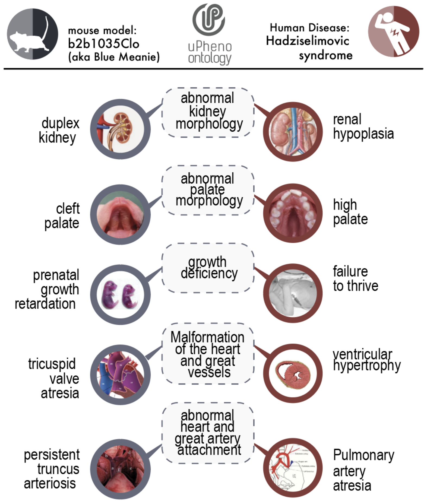

## Use Cases

- [Phenotypic profile matching](#matching)
- [Computational identification of disease models through cross-species phenotype comparison](#diseasemodel)
- [Aggregating phenotype data across species](#aggregation)
- [Predicting phenotype associations using AI](#predicting)
- [Cross-species inference in Variant and Gene Prioritisation algorithms (Exomiser)](#vgpa).
- Use cases for uPheno in the Alliance of Genome Resources and MGI
- Cross-species data in biomedical knowledge graphs (Kids First)

### Phenotypic profile matching

!!! note "Figure 1: Phenotypic profile matching"

    Phenotype profiles can be compared to known disease profiles (i.e. the phenotypic features commonly associated with a disease). They can also compared directly to find similar cases, e.g. [Matchmake Exchange](https://www.matchmakerexchange.org/).

### Computational identification of disease models through cross-species phenotype comparison

See [presentation by Diego Pava](../organization/outreach.md) during a uPheno stakeholder meeting for details on how IMPC leverages cross-species phenotype inference for disease model identification.

!!! note "Figure 2: Phenotypic profile matching"

    Diseases associated with a gene through cross-species inference.
    Source: [https://www.mousephenotype.org/data/genes/MGI:95564](https://www.mousephenotype.org/data/genes/MGI:95564).

!!! note "Figure 3: Mouse model comparison with uPheno"

    A mouse profile on the left is associated with a disease profile on the right through common, species independent subsumers.

### Aggregating phenotype data across species

See also [section on how to integrate phenotype data](../reference/data-integration.md).

!!! note "Figure 4: uPheno cross-species integration"

    uPheno integrates species-specific pre-coordinated phenotype ontologies such as HPO and ZP.
    Species specific phenotype terms like "enlarged heart (ZP)" or "Enlarged heart (HPO)" are
    integrated under a common uPheno class which is species-independent.

### Predicting phenotype associations using AI

TBD.

### Cross-species inference in Variant and Gene Prioritisation algorithms (Exomiser)

!!! note "Figure 5: The Exomiser pipeline"

    [Exomiser](https://exomiser.readthedocs.io/) is a phenotype-powered Variant and Gene Prioritisation System.

