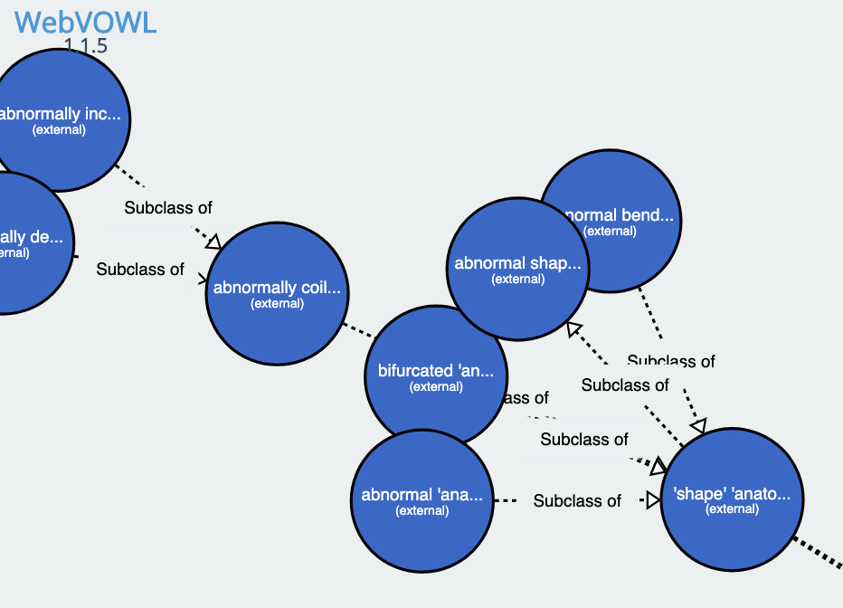

# Design Patterns

This folder contains design patterns for groupings of classes in the ontology.

The design patterns are specified in YAML, and follow the [dead_simple_design_patterns](https://github.com/dosumis/dead_simple_owl_design_patterns/) specification

Consult each yaml file for details on the specific pattern.

Pattern.owl can be inspected using WebVOWL:

See https://github.com/obophenotype/upheno/issues/168

A jenkins job periodically checks all equivalence axioms against these patterns, generating the following tuples:
https://build.berkeleybop.org/job/query-pheno-patterns/lastSuccessfulBuild/artifact/upheno/src/patterns/

Pattern file name = iri
pattern_name= filename w/o .yaml
dosdp-dev when working, but unreviewed
dosdp-patterns when unreviewed
dosdp-workshop when not working yet
